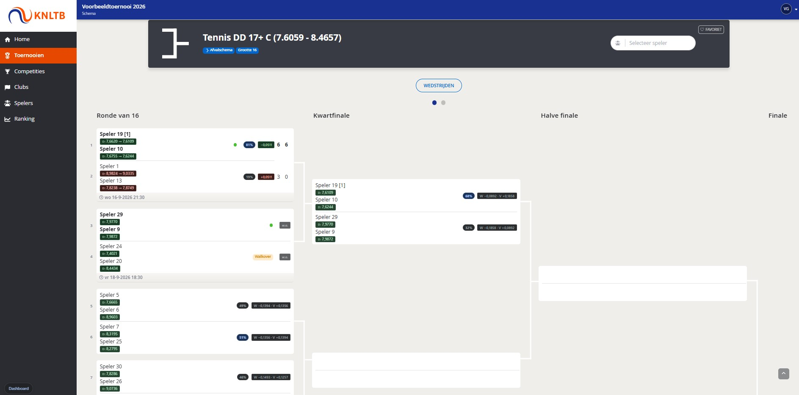
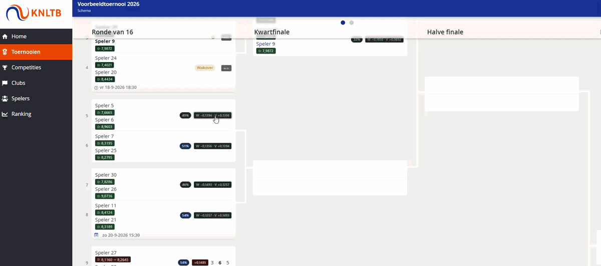

# KNLTB Rating Inline

Chrome-/Brave-extensie die de KNLTB **enkel- en dubbelrating** direct achter spelersnamen
zet op `mijnknltb.toernooi.nl` — zodat je niet meer per speler hoeft door te klikken.

> Onofficieel hobbyproject. Niet gelieerd aan, of goedgekeurd door, de KNLTB of
> Tournament Software. De extensie leest alleen pagina's die je zelf al kunt zien
> als je bent ingelogd; er wordt niets naar een externe server gestuurd.

> In alle afbeeldingen hieronder zijn de spelersnamen vervangen door `Speler 1`,
> `Speler 2`, enzovoort. De ratings en uitslagen zijn wel echt.

## Installeren (Brave én Chrome, zelfde stappen)

1. Download `knltb-rating.zip` van de [laatste release](https://github.com/MyQeV/knltb-rating-plugin/releases/latest)
   en pak die uit naar een map die je laat staan (bv. `C:\Users\<jij>\extensies\knltb-rating`).
2. Ga naar `brave://extensions` (of `chrome://extensions`).
3. Zet rechtsboven **Developer mode / Ontwikkelaarsmodus** aan.
4. Klik **Load unpacked / Uitgepakte extensie laden** en kies de uitgepakte map.
5. Open een toernooipagina op `mijnknltb.toernooi.nl` waar spelersnamen op staan.

## Over de login

Je hoeft nergens een wachtwoord in te vullen. De extensie draait *in jouw browser* en haalt
de profielpagina's op met `fetch(..., {credentials: "include"})`. Daardoor gaat je bestaande
sessiecookie automatisch mee — precies alsof je zelf op de link klikt. Zolang jij ingelogd
bent op mijnknltb, werkt de extensie. Ben je uitgelogd, dan toont de badge `login`.

## De rating achter elke naam

Achter elke spelersnaam komt een badge: `E 6,31 · D 5,87`
(E = enkel, D = dubbel). Hover erover voor details.

- grijs `…` = bezig met ophalen
- geel = rating geraden (labels niet herkend) — check even of het klopt
- rood `–` = geen rating gevonden op het profiel
- rood `login` = je bent niet ingelogd

Elke speler wordt één keer opgehaald en daarna uit de cache bediend, ook als hij verderop
op de pagina onder een andere naamvorm terugkomt.

## Winnaars doorklikken in een afvalschema

Dit is de kern van de extensie. Bij een wedstrijd die **nog niet gespeeld is** staat er geen
mutatie maar een keuzechip: `W −0,0892 · V +0,1858` — wat die kant wint bij winst, en
wat het kost bij verlies.

Klik op die chip en je wijst die kant aan als winnaar. De extensie rekent het hele schema
vanaf dat punt opnieuw door: de ratings schuiven naar de stand ná die wedstrijd, de winnaars
verschijnen in de volgende ronde, en de winstkansen van de rondes daarna worden herberekend
met die nieuwe ratings.

- Klik op de **andere** kant om de winnaar om te draaien.
- Klik nog een keer op dezelfde chip om de keuze terug te nemen.
- Je keuzes blijven lokaal en verdwijnen zodra je de pagina herlaadt. Er wordt niets
  verstuurd en niets opgeslagen bij de KNLTB.

Werkt alleen bij een afvalschema, en alleen bij wedstrijden zonder uitslag. Een walkover of
verstek (`w.o.`) telt niet mee voor de rating en is dus niet aanklikbaar.

## Wat er verder bij een wedstrijd komt te staan

- **Mutatie bij gespeelde wedstrijden** — `−0,0511` bij de winnaar, `+0,0511` bij de
  verliezer. Lagere rating is sterker, dus winst is een minteken.
- **Stand vóór → ná** — `7,6620 → 7,6109`, zodat je ziet waar iemand vandaan kwam.
- **Winstkans per kant** — `81%` / `19%`, berekend uit het ratingverschil.
- **Rondes stapelen** — zet je dit aan, dan begint elke ronde met de stand zoals die na de
  vorige ronde zou zijn, in plaats van met de rating van vandaag. Zo zie je het verloop over
  een heel toernooi in plaats van per losse wedstrijd.
- **Controle** — zet de eigen doorrekening naast het getal dat de KNLTB zelf toont, met een
  ✓ als het tot op vier decimalen gelijk is en een ✗ als het afwijkt. Bedoeld om te kúnnen
  zien dat de formule klopt, niet om iets toe te voegen wat de site al zegt.

## Het paneel met de doorrekening

Rechtsonder staat **Doorgerekend**: een samenvatting van het hele onderdeel. Bovenaan het
aantal spelers met de sterkste, de mediaan en de zwakste rating; daaronder per speler drie
kolommen — **NU**, **BESTE** (hoe ver je kunt zakken als alles meezit) en **SLECHTSTE**.
Het paneel is te sluiten en komt bij de volgende scan niet ongevraagd terug.

## Jezelf in het veld zetten

Sta je zelf niet in een schema, dan kun je jezelf er toch bij laten rekenen. De extensie
zet je als hypothetische deelnemer in het veld en laat zien waar je zou staan. Bij een
dubbelonderdeel kun je een **partnerrating** invullen; de teamrating is dan het gemiddelde
van jullie twee. Vul je niets in, dan wordt er gerekend met een partner van gelijke sterkte.

## Rating-calculator

In de popup zit een losse rekenmachine: vul 2 ratings in voor enkel of 4 voor dubbel, en je
ziet de winstkans en wat de partij aan beide kanten met de rating doet.

## Ratingverloop op je profiel

> **Nog niet af.**

Op `/player-profile/<id>/Rating` probeert de extensie het verloop van je rating te tekenen.
De reeks wordt uit de pagina zelf gelezen: eerst uit de grafiekgegevens, anders uit een
tabel met per rij een datum en een rating. Levert de pagina geen van beide, dan blijft de
grafiek leeg — de opbouw van die pagina ligt niet vast en verandert weleens. Het verloop in
**Mijn overzicht** op het dashboard werkt los hiervan.

## Dashboard

> **Nog niet af.**

De knop **Open dashboard** in de popup opent een eigen pagina met vier tabbladen:

- **Toernooi-verkenner** — plak een URL van een inschrijflijst (`/sport/event.aspx?…`), een
  schema (`/tournament/…/draw/N`) of een poule, en je krijgt het hele veld met ratings,
  winstkansen en wat winst of verlies zou doen. Ook hier kun je een partner invullen, als
  rating of als link naar een speler.
- **Mijn overzicht** — je eigen cijfers met het verloop over het seizoen.
- **Vergelijker** — vul jezelf en een tegenstander in (met partner voor dubbel, leeg voor
  enkel) en zie de uitkomst.
- **Opgeslagen spelers** — alles wat in de cache staat, doorzoekbaar op naam, met opnieuw
  ophalen en legen.

## Instellingen

Klik op het extensie-icoon. Alles staat daar aan of uit:

| Instelling | Wat het doet |
|---|---|
| Ingeschakeld | alles aan/uit |
| Enkelrating / Dubbelrating tonen | welke van de twee je in de badge wilt |
| Rating-mutatie bij wedstrijden | `−0,0511` / `+0,0511` achter een uitslag |
| Ratingverloop op profielpagina | de grafiek op je eigen profiel |
| Paneel met de doorrekening | **Doorgerekend** rechtsonder |
| Winstkans per kant | `81%` / `19%` |
| Stand vóór → ná | `7,6620 → 7,6109` in plaats van één getal |
| Controle | eigen som naast die van de KNLTB |
| Mijzelf in het veld tonen | ook zonder inschrijving meerekenen |
| Toernooirondes op elkaar stapelen | het verloop over het hele toernooi |
| Alleen ophalen bij muis-over | niets ophalen tot jij een naam aanwijst |
| Max. requests per minuut · Gelijktijdig | hoe hard de site bevraagd wordt |
| Max. op te halen per scan | bovengrens per pagina |
| Cache (uren) | hoe lang een rating goed blijft (standaard 8 uur) |
| Badge verbergen als er geen rating is | rustiger beeld |
| Onzekere ratings tonen (geel) | ook tonen als de naam afwijkt van het profiel |
| Debug-logging | uitgebreide uitvoer in de console |

Verder: **Pagina opnieuw scannen** en **Cache legen**.

## Rustig aan met de site

De extensie haalt niet meer op dan nodig: één verzoek per speler, resultaten blijven in de
cache staan, en er geldt een limiet per minuut plus een maximum aan gelijktijdige verzoeken.
Wie al in de cache staat kost geen enkel verzoek. Staat de rating al in een kolom op de
pagina — zoals op een inschrijflijst — dan wordt er helemaal niets opgehaald. Is de server
druk, dan wordt er vanzelf rustiger aan gedaan in plaats van doorgeramd.

## Problemen melden

Open een [issue](https://github.com/MyQeV/knltb-rating-plugin/issues). De knop
**Diagnose** in de popup verzamelt wat er op de pagina gevonden is; die uitvoer bevat
spelersnamen en je eigen profiel-id, dus haal weg wat je niet wilt delen.

## Licentie

[MIT](LICENSE)
